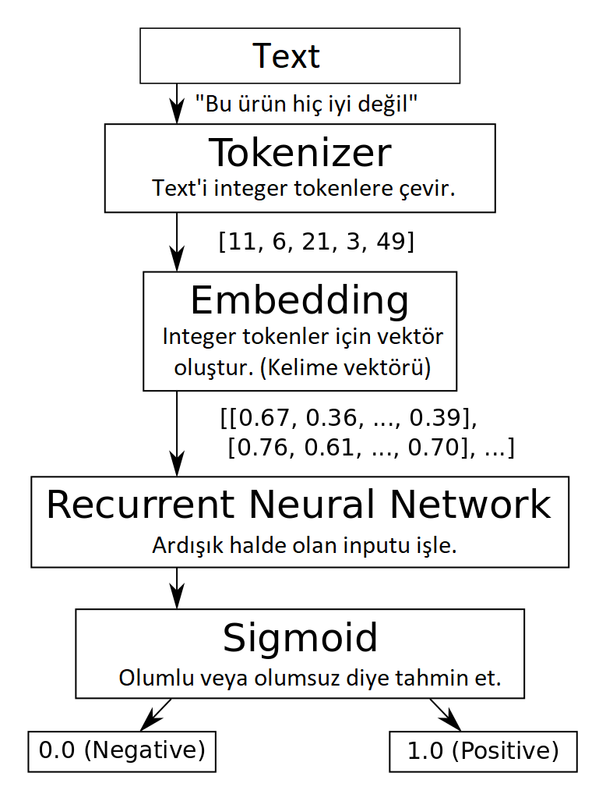

# Deep Natural Language Processing Project (Sentiment Analysis)

HepsiBurada is most visited and largest E-commerce website in Turkey. I have user's Product comments and rating is comment negative or positive. So I'm working on web deploying on this project, will adding soon!

## Made with using Tools:

* Tensorflow / Keras
* Numpy
* Pandas

## Model Architecture:

* Many to one RNN
* Gated Recurrent Unit
* Based on LSTM model

